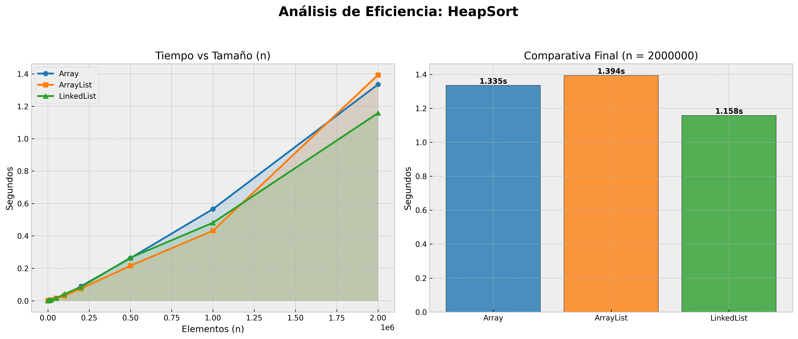
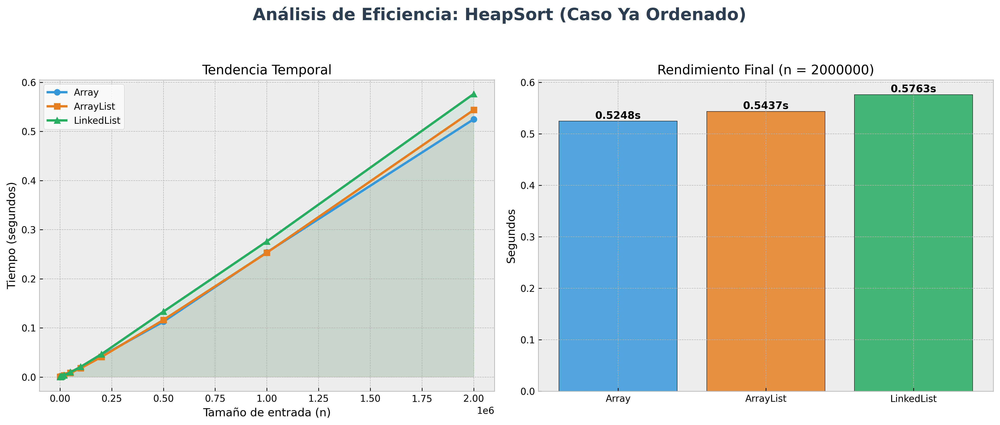
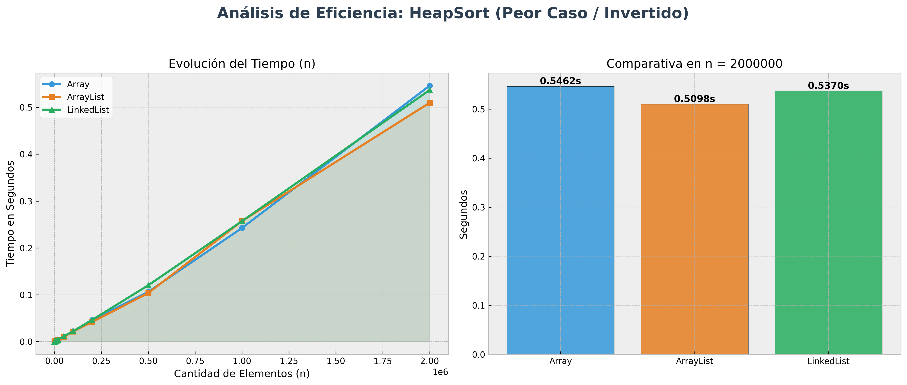

# Informe Técnico: HeapSort

**HeapSort** es un algoritmo de ordenamiento basado en la estructura de datos *heap binario*, típicamente un **max-heap**. Su funcionamiento se apoya en dos fases principales:

1. **Construcción del heap** a partir de los datos de entrada.
2. **Extracción iterativa del máximo**, colocándolo al final del arreglo y reajustando el heap.

Conceptualmente, puede imaginarse como una estructura jerárquica donde el elemento de mayor valor siempre ocupa la raíz, facilitando su extracción ordenada.

## Implementaciones y Comparativa

### HeapSort con Array

**Características:**

* Acceso aleatorio en tiempo constante (O(1))
* Representación directa del heap mediante índices
* Alta localidad de memoria (cache-friendly)

**Ventajas:**

* Alto rendimiento en la práctica
* Implementación simple y directa
* Sin sobrecarga adicional de estructuras dinámicas

**Desventajas:**

* Tamaño fijo en lenguajes como C
* Menor flexibilidad estructural

**Conclusión:**
Es la implementación **más eficiente y natural**. HeapSort está diseñado para operar sobre arreglos.

---

### HeapSort con ArrayList

**Características:**

* Estructura dinámica basada internamente en arrays
* Acceso aleatorio (O(1))

**Ventajas:**

* Flexibilidad en el tamaño
* Código más expresivo en lenguajes modernos

**Desventajas:**

* Ligera sobrecarga por gestión dinámica
* Posibles costos de redimensionamiento

**Conclusión:**
Ofrece un rendimiento **muy cercano al array**, siendo una opción adecuada cuando se requiere flexibilidad.

---

### HeapSort con LinkedList

**Características:**
* Acceso por índice en (O(n))
* Memoria no contigua

**Ventajas:**

* Inserciones y eliminaciones eficientes (no relevantes para HeapSort)

**Desventajas:**

* Acceso ineficiente para operaciones de heap
* Baja localidad de memoria
* Penalización significativa en rendimiento

**Conclusión:**
No es una estructura adecuada para HeapSort. Su uso implica una degradación del rendimiento debido a la falta de acceso aleatorio eficiente.

## Complejidad Algorítmica

La complejidad total de HeapSort es: **O(n \log n)**

### Justificación:

* **Construcción del heap:** (O(n))
* **Extracciones:** (n) operaciones de (O(\log n))

Resultado total:

* Mejor caso: (O(n \log n))
* Caso promedio: (O(n \log n))
* Peor caso: (O(n \log n))

**Conclusión:**
HeapSort presenta un comportamiento **determinista y estable en complejidad**, independiente del orden inicial de los datos.

## Casos de Uso

### ✔ Recomendado cuando:

* Se requiere **complejidad garantizada** (O(n \log n))
* Se desea evitar el peor caso de algoritmos como QuickSort
* Se necesita un algoritmo **in-place** (uso de memoria (O(1)))

### ❌ No recomendado cuando:

* Se requiere **estabilidad** (HeapSort no es estable)
* El volumen de datos es pequeño
* La estructura no permite acceso aleatorio eficiente

## Resultado de Laboratorio

### Datos Aleatorios

* **Array y ArrayList** presentan el mejor rendimiento
* **LinkedList** es más lento debido al acceso secuencial
* HeapSort mantiene comportamiento uniforme

**Nota crítica:**
La supuesta ventaja de LinkedList en grandes volúmenes es **sospechosa** desde el punto de vista teórico. HeapSort depende de acceso por índice; si LinkedList resulta más rápido, probablemente:

* La implementación **no es un HeapSort puro**
* Se están midiendo efectos de memoria o caché

---

### Datos Ordenados

* No hay mejora significativa
* HeapSort no aprovecha el orden previo

**Resultado:**
Rendimiento prácticamente idéntico al caso promedio.

---

### Datos Invertidos

* Mismo comportamiento que otros casos
* Se confirma la independencia del input

---

### Escalabilidad

* Todos los casos crecen conforme a (O(n \log n))
* Array mantiene ventaja constante
* LinkedList escala peor debido a su estructura

## Discusión Técnica

HeapSort destaca por su **consistencia**, pero no por ser el más rápido en la práctica. Su rendimiento real depende fuertemente de la estructura subyacente:

* **Array:** maximiza eficiencia por acceso directo y caché
* **ArrayList:** ligera penalización por abstracción
* **LinkedList:** incompatibilidad estructural con el algoritmo

---

## Conclusión General

HeapSort es un algoritmo:

* **Robusto**: sin degradación en peor caso
* **Predecible**: comportamiento uniforme
* **Eficiente en memoria**: in-place

Sin embargo:

* No es el más rápido frente a alternativas como QuickSort
* Su rendimiento depende críticamente de la estructura utilizada

###  Síntesis final

* **Array > ArrayList >> LinkedList**
* HeapSort prioriza **garantía sobre velocidad máxima**
